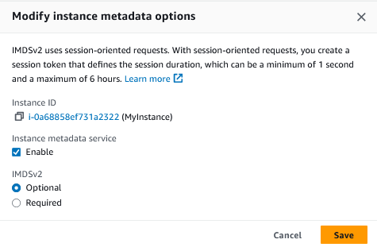

# 🧠 2.4 Accessing Your EC2 Instance
* EC2 instances are identified by their unique IP address
* All instances are assigned at least one privare IPv3 address which by default falls into one the three IP address ranges used by private networks:

| From           | To              |
|----------------|-----------------|
| `10.0.0.0`     | `10.255.255.255` |
| `172.16.0.0`   | `172.31.255.255` |
| `192.168.0.0`  | `192.168.255.255` |

* By default, you'll only be able to connect to your instance from within its subnet, and the instance will NOT have any direct connection to the internet.
* If your instance calls for multiple network interfaces to connect to resources, each of the interfaces must be connected to an existing subnet and security group. You can optionally assign a static IP address within the subnet range.

<br>

* An instance can also be assigned a public IP address which makes them internet facing
  - By default, this public IP address is ephemeral
* For long term deployments, you want to allocate a permanent elastic IP address - there's no charge for this as long as it is attached to a running instance.

<br>

* The instance metadata system reveals alot about runnind an EC2 instance and connecting to IP addresses
* Running a curl command directly from you instance, you can get the metadata about the instance:
```sh
$ curl http://169.254.169.254/latest/meta-data/
```
* I was trying to curl the metadata API but was getting a `401 - unauthorised` error

   - I found an [aritcle](/https://www.jackcollins.me.uk/articles/ec2_imdsv2/) which suggested setting IMDBSv2 to optional
   - The below settings can be found by clicking on `Actions` > `Instance settings` > `Modify instance metadata options`l 

* I can now run the command successfully:
```sh
[ec2-user@ip-172-31-39-58 ~] curl http://169.254.169.254/latest/meta-data/eta-data/
ami-id
ami-launch-index
ami-manifest-path
block-device-mapping/
events/
hostname
identity-credentials/
instance-action
instance-id
instance-life-cycle
instance-type
local-hostname
local-ipv4
mac
managed-ssh-keys/
metrics/
network/
placement/
profile
public-hostname
public-ipv4
public-keys/
reservation-id
security-groups
services/
```
* The entries ending with `\` contain further sublevels of information
* You can access these sublevels like:
```sh
$ curl http://169.254.169.254/meta-data/security-groups launch-wizard-1
```