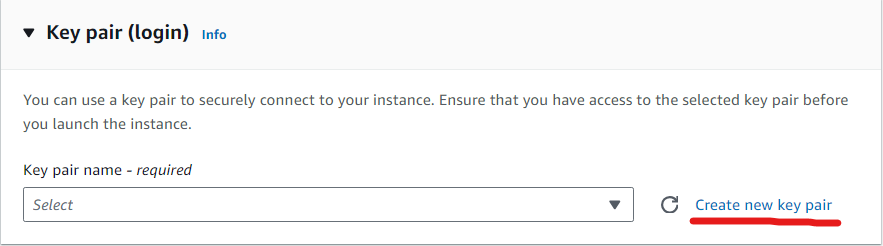
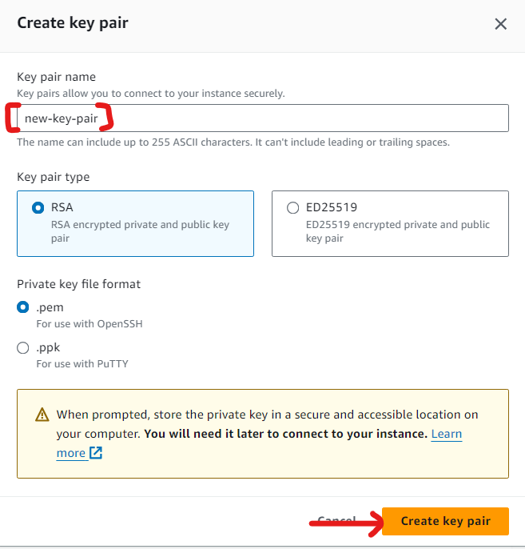
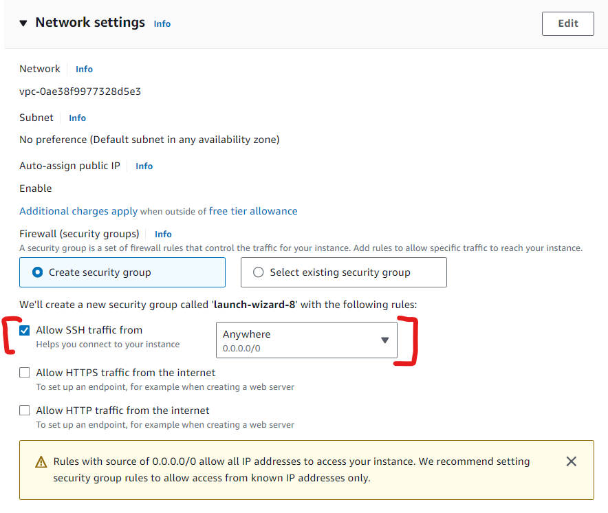
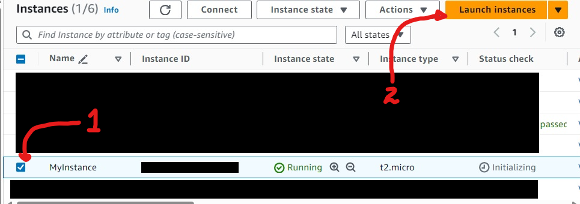
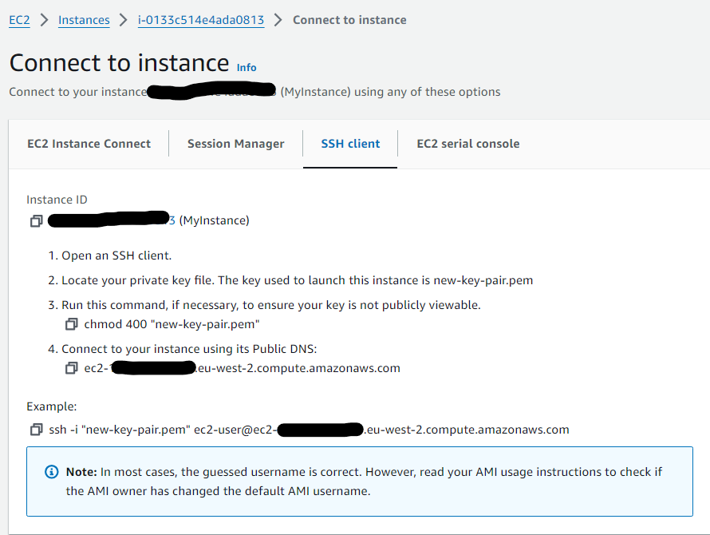
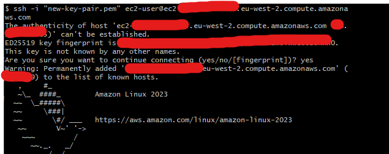

# 🏋️ Exercise 2.1 Launch an EC2 Linux Instance and Login Using SSH 🏋️

## ✏️ Description ✏️
1. From the EC2 Dashboard, click to launch a new instance and select a Linux AMI and instance type. Remember, `t2.micro` is Free Tier - eligble if you account is still within its first yeart
2. Explore the Network Settings, Configure Storage, and Advanced selection - although the default settings 
3. In the Network Settings section, make sure there's a rule permitting incoming SSH (port 22) traffic. It should be there by default. You can create your own security group or select an existing group by clicking the Edit button. Default settings will all normally work well here
4. Before letting you launch the instance, AWS will require you to select - or create - a key pair. Follow the instructions.
5. Once the instance is launched, you can return to the Instances Dashboard to wait a minute or two until everything is running properly.
6. Click the Actions pull-down menu and select Connect for instructions on how to connect to the Instance from your local machine. Note how the SSH username will vary, for instance, bbetween Linux distributions. Then connect and take a look at your virtual cloud server.,

## ✅ Solution ✅
* I created an EC2 instance
* I left the default options on for the AMI and instance type (`Amazon Linux 2023 AMI` and `t2.micro`)
* For the Key pair (login), I create a new key-pair:

* I provide the name of the key-pair, and click `Create key pair` which downloads the `.pem` file on my computer:


<br>

* For the Network settings, I check the tick box to allow SHH (port 20) traffic from anywhere:


* I leave everything else, and launch my instance

<br>

* Go to the instances page, I select my instance, and click on the `Connect` button:

* This opens up instructions on how to connect:

* I open up bash where my pem file, and execute the following commands:
```sh
$ chmod 400 "new-key-pair.pem"
ssh -i "new-key-pair.pem" ec2-user@ec2-11-111-111-11.eu-west-2.compute.amazonaws.com
```
* I then get asked if I want to connect, and I confirm
* I see a bird in the console which confirms I've connected

