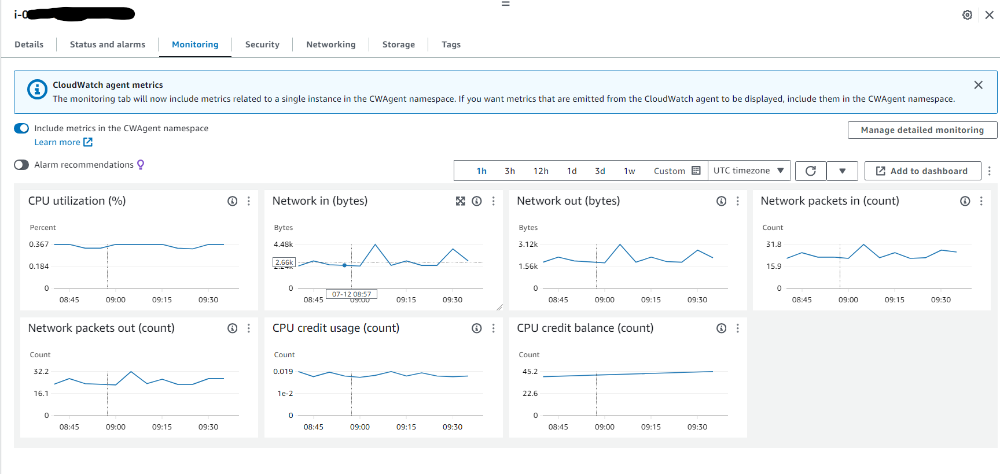
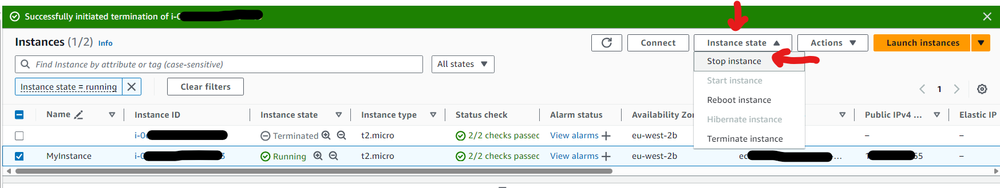

# 🏋️ Exercise 2.2 Access the Free Capacity of a Running Instance and Change It's Instance Type 🏋️

## ✏️ Description ✏️
1. With an instance running, open the Instances Dashboard in the EC2 console. Select the instance you're interested in and click the Monitoring tab in the bottom half of the screen. That's a good place to see what percentage of compute and network resource you've been using over the past hours of weeks.

Now pretend that your instance is nearly maxed out and change thhe instance type as follows.

2. Stop the instance using the Instance State drop-down menu. (Remember, unless you're using an elastic IP address for the instance, your public IP address might be different when you start up again.)

3. From the Actions drop-down menu, click Instance Settings and then Change Instance Type (which might only appear after a minute or so or once you refresh the page). Select a new type (although remember that choosing a non-Free Tier instance type might incur costs).

4. Restart the instance and confirm that it's running properly

## ✅ Solution ✅
* I select the instance I created in Exercise 2.1, and click on the monitoring tab:
   
   

* I click on the `Instance state` dropdown, and click `Stop instance`:
   

* I enable the `Termination protection` option
* I restart the instance