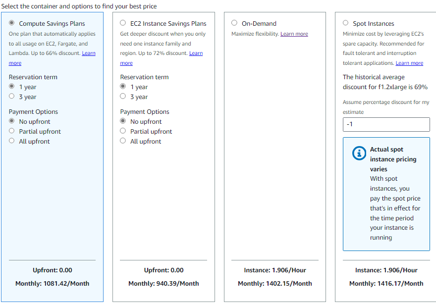

# 🏋️ Exercise 2.3 Assess Which Pricing Model Will Best Meet the Needs of a Deployment 🏋️

## ✏️ Description ✏️
* Imagine that your application will need to run two always-on `f1.2xlarge` instance (which come with instance storage and won't require any EBS volumes)
* To meet seasonal demand, you can expect to require as many as four more instances for a total of 100 hours through the course of a single year. How should you pay for this deployment?

## ✅ Solution ✅

* I go to [https://calculator.aws/#/createCalculator/ec2-enhancement](https://calculator.aws/#/createCalculator/ec2-enhancement)
* I specify the EC2 instance as `inf1.2xlarge`
* Using the calulator, I configure the following:
  - Tenancy as Shared
  - OS as Linux
  - Workload
    - Graph: Monthly spike traffic
    - Baseline instances: 1
    - Peak instances: 4
    - Peak duration: 1 hour, 53 minutes
  - EC2 Instance type: `f1.2xlarge`
* I am presented with the following Payment options:
  
   

* The Savings Plans offers 940.39/month
* This would be 11284.68 for the year