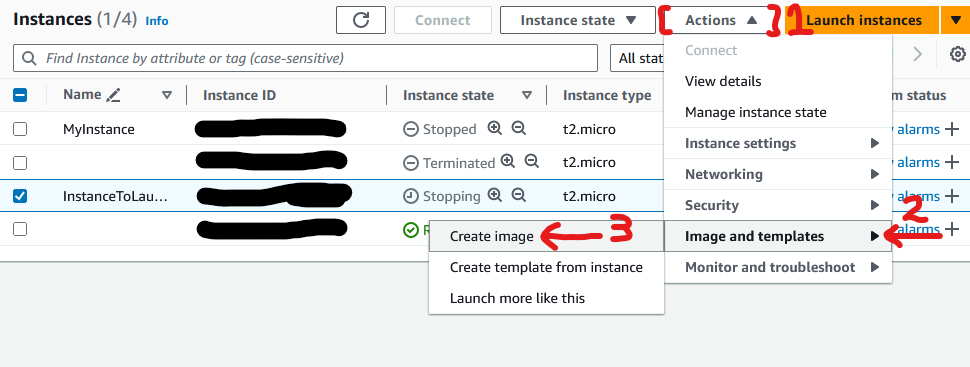
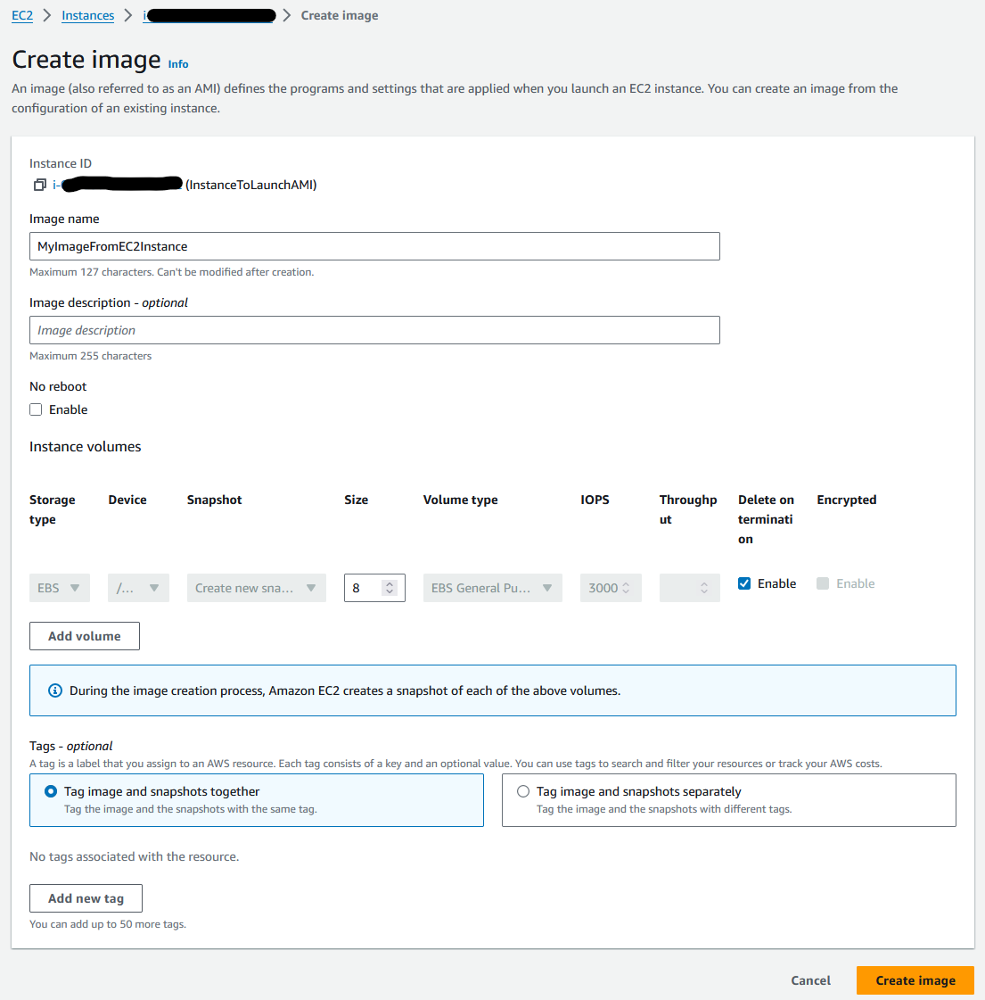

# 🏋️ Exercise 2.4 Create and Launch an AMI Based on an Existing Instance Storage Volume 🏋️

## ✏️ Description ✏️
1. If necessary, launch an instance and make at least some token change to the root volume. This could be something a simple as typing `touch test.txt` on a Linux instance to create an empty file.
2. Create an image from the instance's volume (you'll access the dialog through the Actions pull-down menu in the Instance's Dashboard)
3. Launch an instance from the console and select the new AMI from the My AMIs tab
4. Log into the instance and confirm rhhat your previous change has persisted.


## ✅ Solution ✅
* I create a new EC2 instance
* I SSH into my instance and then I touch the `test.txt` file
   ```yaml
   [ec2-user@ip-172-31-32-222 ~]$ touch test.txt
   [ec2-user@ip-172-31-32-222 ~]$ ls
   test.txt
   ```
* I stop my instance, and click on `Create image`:


* I am shown the `Create image` wizard which takes a snapshot of the EBS volume:
   

* I name the image and click `Create image` button

* I launch a new instance, I select the `My AMIs` tab to select the snapshot I created
* I launch the instance and confirm I still can see the file I created!