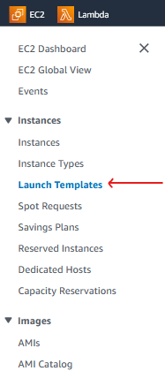
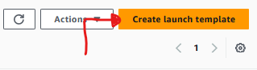
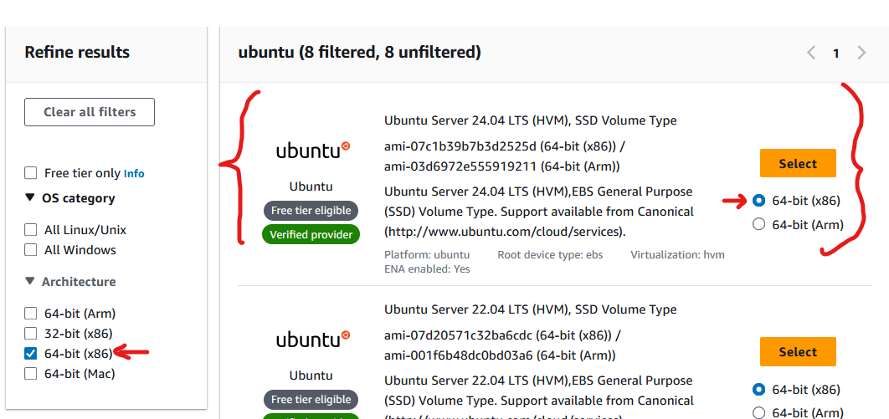
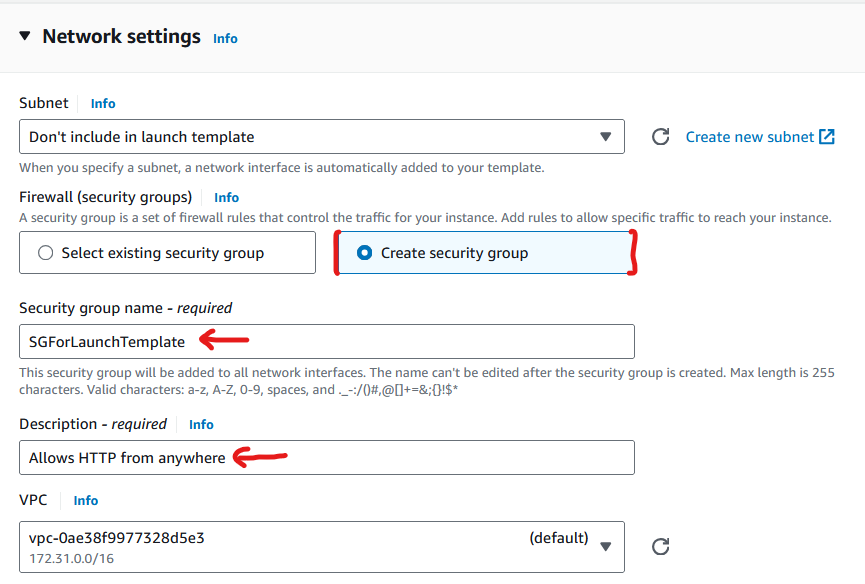
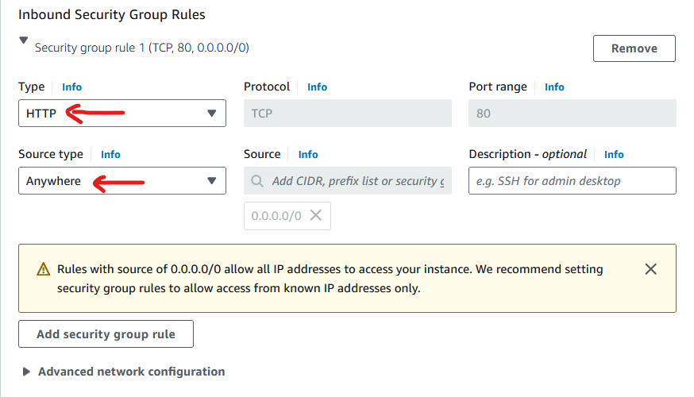
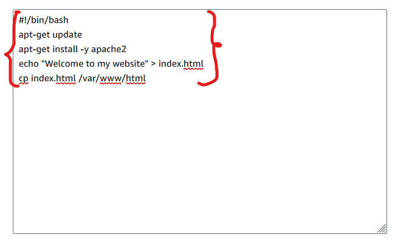
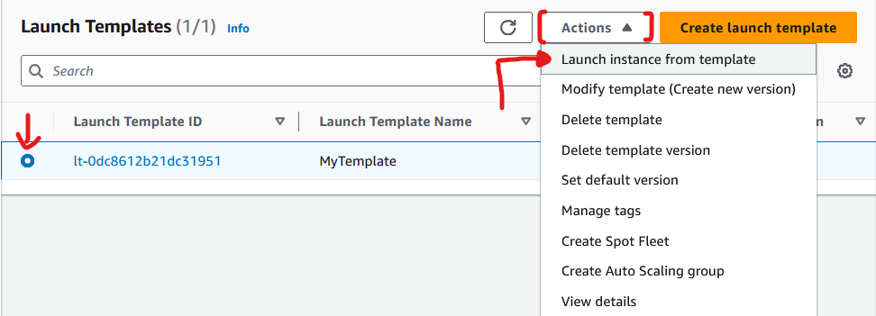
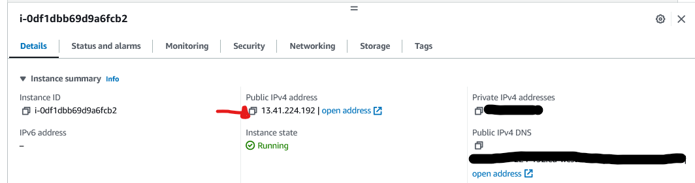
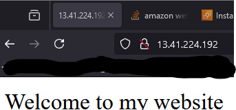

# 🏋️ Exercise 2.5 Create a Launch Template 🏋️

## ✏️ Description ✏️
* In this exercise, I'll create a launch template that installs and configures a simple web server. You'll then use the launch template to manually create an instance.
1. In the EC2 Dashboard, click Launch Templates.
2. Click the Create Launch Template button.
3. Give the launch template a name such as `MyTemplate`
4. Cick the `Search for AMI` link to locate one of the Ubuntu Server LTS AMIs (make sure the AMI you choose uses the 64-bit x86 architecture and not 64-bit ARM)
5. For instance type, select `t2.micro`
6. Under Security Groups, select a security group that allows inbound HTTP access. Create a new security group if necessary
7. Expand the Advanded Details section, and enter the following in the User Data field:
```sh
#!/bin/bash
apt-get update 
apt-get install -y apache2
echo "Welcome to my website" > index.html
cp index.html /var/www/html
```
8. Click the `Create Launch Template` button.
9. Click the Launch Instance From This Template link.
10. Under Source Template Version, select 1 (Default)
11. Click the Launch Instance From Template button.
12. After the instance boots, browse to its public IP address. You should see a web page that says "Welcome to my website"
13. Terminate the instance when you're done with it.

## ✅ Solution ✅
* In the EC2 console, I click on the `Launch Templates` link


* I click on the `Create launch template` button:


* I give the name as `MyTemplate`
* I search for `Ubuntu` in the AMI selection, and select the top result with `64-bit (x86)` selected:



* I set the instance type to `t2.micro`

* Under Network settings, I create a new Security Group:



* I add a new Inbound Security Group rule to allow HTTP from anywhere:



* Under Advanced details, I specify the `User data` as:



* I click `Create launch template`

<br>

* I select my launch template in the `Launch Templates` view, and click `Actions` > `Launch instance from template`:



* This opens a wizard, and I leave everything as default (to use the templates configuration), and click `Launch Instance`

* I go to my newly launched instance and find the `Public IPv4 address`



* I open us the IP address (13.41.224.192) in the browser:



* NOTE: if you use the `open address` link, it will open a tab with address with `https://` pre-appended to ip address - this will NOT work⚠️