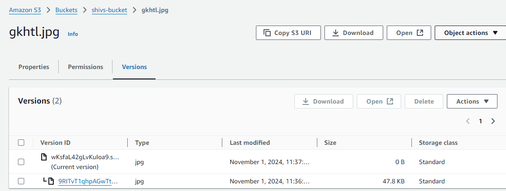
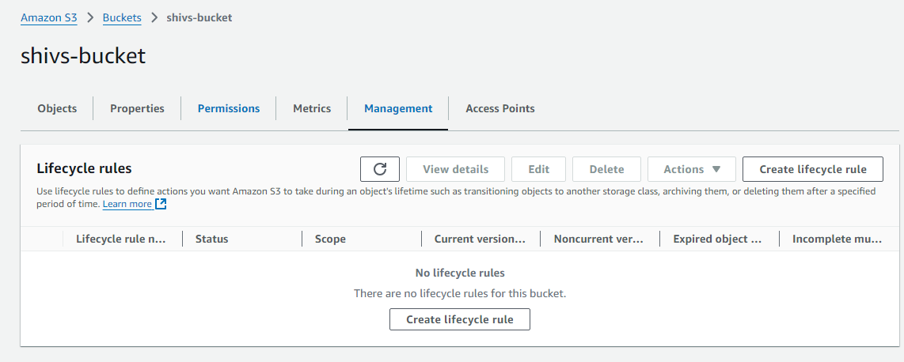
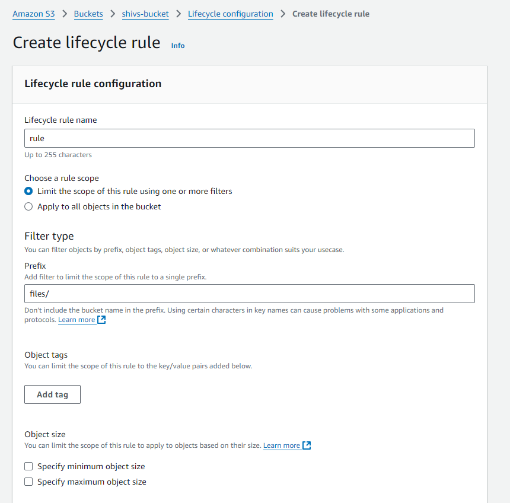
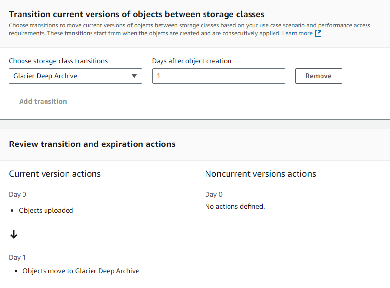

# 🏋️ Exercise 3.2 Enable Versioning and Life Cycle Management for an S3 Bucket 🏋️

## ✏️ Description ✏️
1. Select your bucket and edit its properties to enable versioning
2. Upload a file to that bucket, edit the copy on your local computer, and upload a new copy (keeping the filename the same). Make sure you give the new file any access permissions you might need.
3. With the contents of the bucket displayed in the dashboard, select Show Versions. You should now see two versions of your file.
4. Add a couple of directories with files to your bucket
5. On the bucket's Management tab, create a life cycle rule and specify a prefix/tag filter that matches the directory name of one of the directories you uploaded.
6. Configure a life cycle rule by adding transitions and configuring the transition timing (in days) and target for each one.

## ✅ Solution ✅
* I create a S3 bucket called `shivs-bucket`
* I enable bucket versioning in the wizard 
* I create a directory called `/archive`
* I upload a file into the root of bucket
* I upload a file with same name into root of bucket
* I move the file into a folder called `/files`
* I click on the file, and clicked on the `Versions` tab:

 

* I click on the `Management` tab on the bucket:

* I create a lifecycle rule with a name of `rule`
* I set the filter type's prefix to `files/`

* I check `Transition current versions of objects between storage classes`
* I choose `Glacier Deep Archive` as the transition and 1 day for days after object creation

