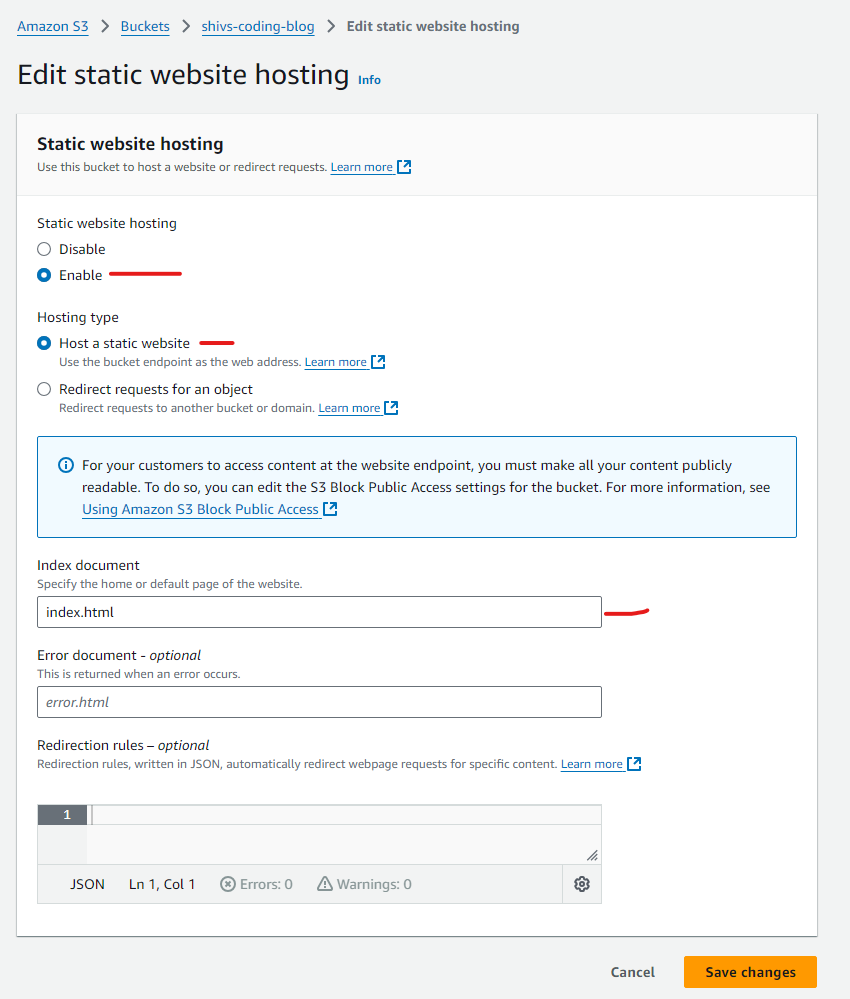
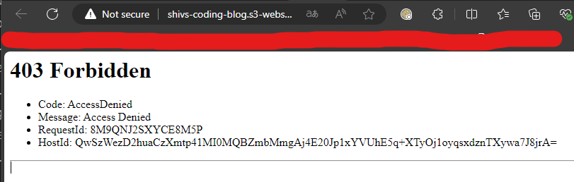
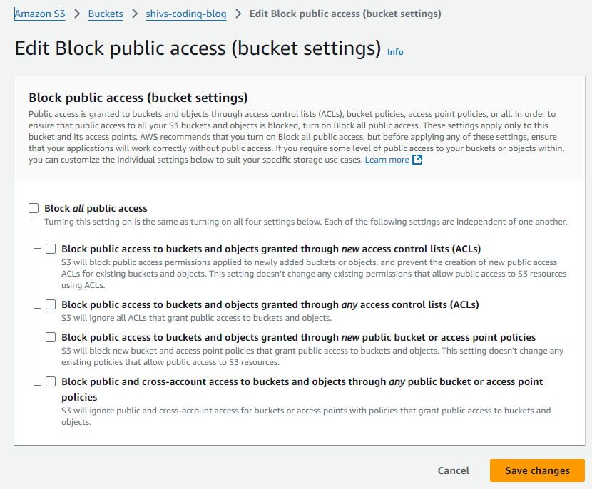
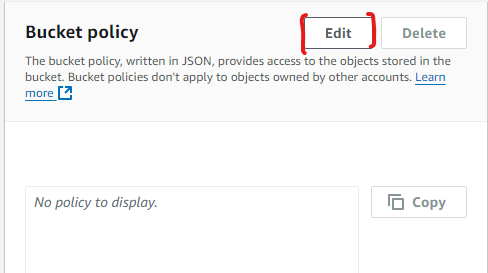
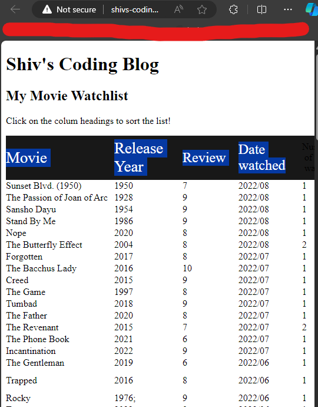

# 🏋️ Exercise 3.4 Enable Static Website Hosting for an S3 bucket 🏋️

## ✏️ Description ✏️
1. From the S3 dashboard, select (or create) an S3 bucket that contains at least one file with some simple text named `index.html`. Any files you want to be accessible should be readable by the public. You may need to change the Block Public Access settings for the bucket to allow access.
2. On the bucket's Properties tab, enable static website hosting and specify your `index.html` file as your index document.
3. Paste the static website endpoint into the URL field of a browser that's not logged into your AWS account and confirm that you can access

* Note: you can also enable static website hosting from the AWS CLI using a variation of these two commands:
```
aws s3api put-bucket-acl --bucket my-bucket --acl public-read
aws s3 website s3://my-bucket/ --index-document index.html\ --error-document error.html
```
   
## ✅ Solution ✅
* I create a bucket called `shivs-coding-blog`
* I add [this](./index.html) file into my bucket 
* On the properties tab, I edit the Static Website Hosting settings
* I specify Index Document so it picks up the index.html file:
   <details>

   <summary>Screenshot</summary>
   
   
   </details>

* I try to access my statically host website via the public URL ([http://shivs-coding-blog.s3-website.eu-west-2.amazonaws.com/](http://shivs-coding-blog.s3-website.eu-west-2.amazonaws.com/)), but get a 403 permission denied error
   <details>

   <summary>Screenshot</summary>
   
   
   </details>

* I used this article in the AWS docs to help me figure out what to do: [https://docs.aws.amazon.com/AmazonS3/latest/userguide/HostingWebsiteOnS3Setup.html#step3-edit-block-public-access](https://docs.aws.amazon.com/AmazonS3/latest/userguide/HostingWebsiteOnS3Setup.html#step3-edit-block-public-access)


* I disable all the bucket access control limits:
   <details open>
   <summary>Screenshot</summary>
   
  

   </details>

* I click on the Permissions tab of the bucket, and click edit on the Bucket Policy row:
   <details>
   <summary>Screenshot</summary>
   
   
   </details>


* I paste the following into the `Bucket Policy Editor`
   ```json
   {
      "Version": "2012-10-17",
      "Statement": [
         {
            "Sid": "PublicReadGetObject",
            "Effect": "Allow",
            "Principal": "*",
            "Action": [
               "s3:GetObject"
            ],
            "Resource": [
               "arn:aws:s3:::shivs-coding-blog/*"
            ]
         }
      ]
   }
   ```
* Now the link is accessible:
   <details>
   <summary>Screenshot</summary>
   
   
   </details>

